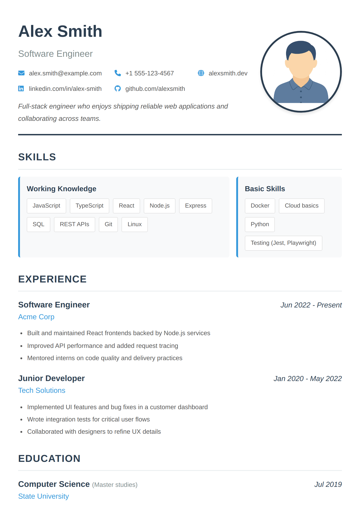
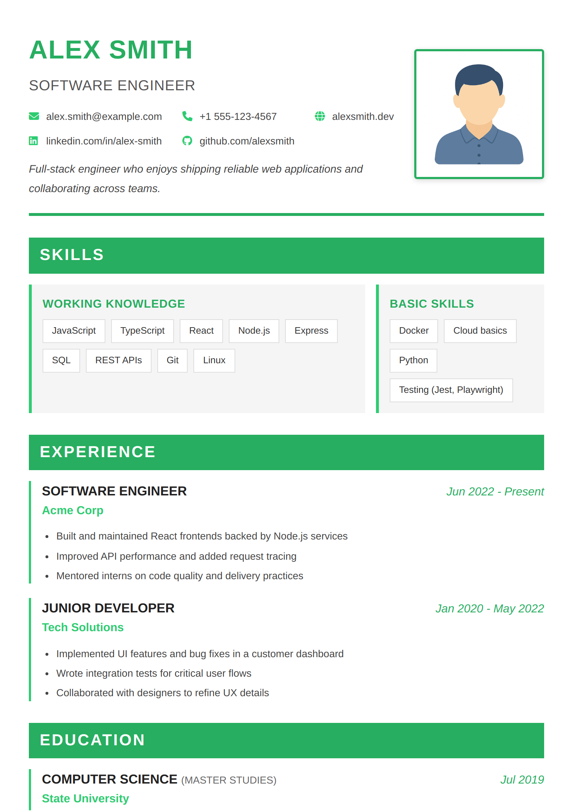
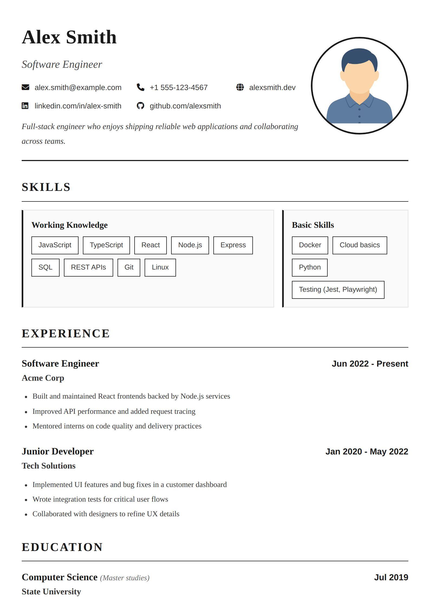

# Resume Generator

A simple tool to create professional-looking resumes from JSON data. Write your resume content once, then generate it in multiple themes and colors to find the perfect style.

## Features

- **Multiple themes**: Choose from modern, classic, minimalist, corporate, and more
- **Color variants**: Most themes support different color schemes (blue, green, red, violet, etc.)
- **Photo support**: Add a professional photo to your resume
- **Dual output**: Get both HTML (for web) and PDF (for printing/sending) versions
- **Data-driven**: Edit your resume in simple JSON format, no HTML required
- **Flexible schema**: Reorder or delete sections which you don't need
- **Fully customizable**: You can modify the code according to your needs using your own skills or AI agents

## Getting Started

### Installation

```bash
npm install
```

### Create Your Resume

1. **Prepare your data**: Copy `data/resume-data-example.json` to `data/resume-data.json` and edit it with your information
2. **Add your photo** (optional): Place your photo as `assets/photo.jpg` or `assets/photo.png`

### Generate Your Resume

**Generate all variants** (all themes and colors):
```bash
npm start
```
This creates all possible combinations in the `output/` folder.

**Generate a specific variant**:
```bash
node src/index.js --theme modern --color violet --input data/resume-data.json --output output
```

**Available themes**: `modern`, `default`, `corpo`, `linux`, `classic`, `minimalist`
**Available colors**: `blue`, `green`, `red`, `violet`, `orange`, `pink`, `yellow`, `grey`

Note: Monochromatic themes (`classic`, `minimalist`) don't use color variants.

## Preview

Below you can find some examples of what your resume can look like:

### Default Theme (Blue)


### Corporate Theme (Green)


### Classic Theme (Monochrome)


## Contributing

Feel free to submit issues or pull requests if you have ideas for new themes or improvements!

The spacing of resume elements should be independent of the theme. In other words, applying a new theme should not alter the length of the visible content.
